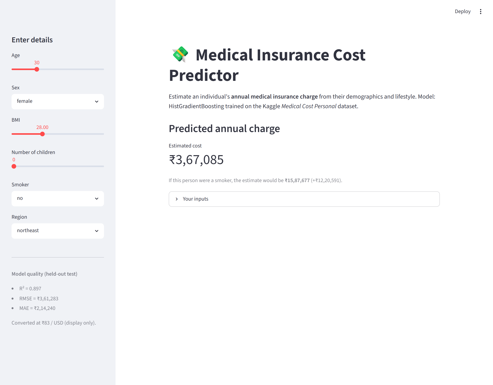
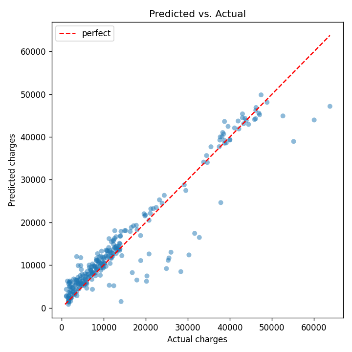
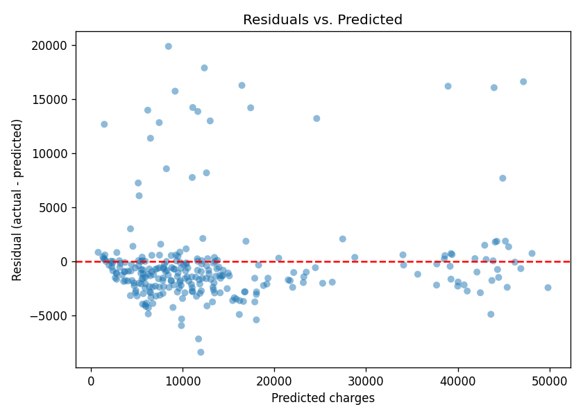
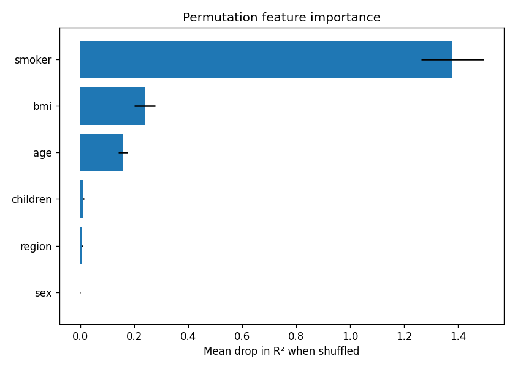
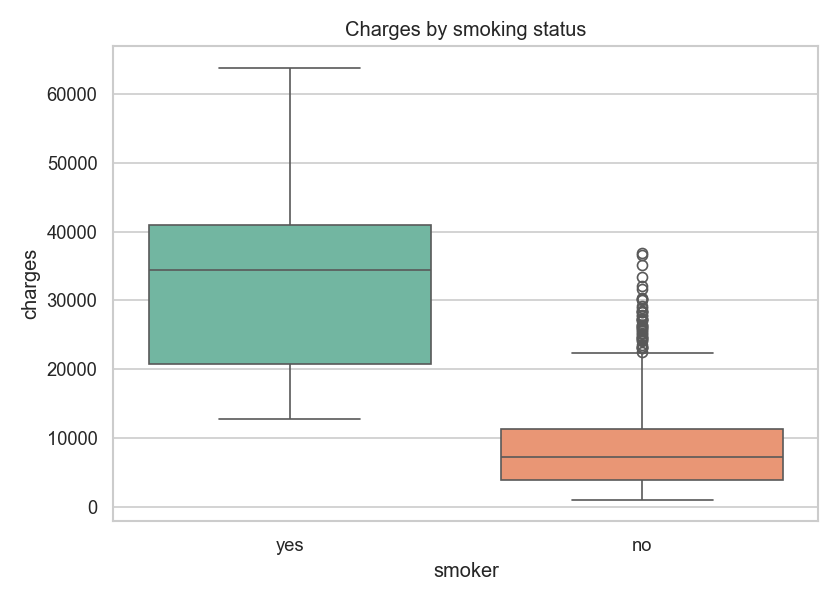
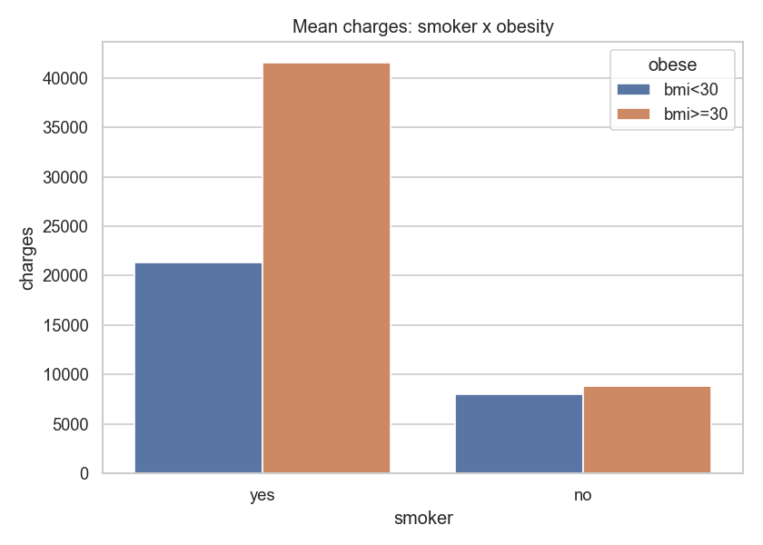

# 💸 Medical Insurance Cost Prediction

An end-to-end machine-learning project that predicts an individual's **annual medical
insurance charge** from their demographics and lifestyle. It covers the full lifecycle:
exploratory data analysis → preprocessing → model comparison & tuning → evaluation →
model persistence → an interactive web app.

> **Question (from Kaggle):** *Can you accurately predict insurance costs?*
> **Dataset:** [Medical Cost Personal Datasets](https://www.kaggle.com/datasets/mirichoi0218/insurance/data) (1,338 rows).

---

## Live demo

The Streamlit app estimates the annual charge in real time and shows a
**smoker counterfactual** (the same person with their smoking status flipped —
the dataset's single biggest cost driver). Amounts are displayed in **Indian
Rupees (₹)**.



```bash
streamlit run app.py
```

---

## Problem statement

This is a **supervised regression** task. Given six features, predict the continuous
target `charges` (USD).

| Feature    | Type        | Description                                  |
|------------|-------------|----------------------------------------------|
| `age`      | numeric     | Age of the primary beneficiary               |
| `sex`      | categorical | `female` / `male`                            |
| `bmi`      | numeric     | Body-mass index                              |
| `children` | numeric     | Number of dependents covered                 |
| `smoker`   | categorical | `yes` / `no`                                 |
| `region`   | categorical | `northeast`/`northwest`/`southeast`/`southwest` |
| **`charges`** | **numeric (target)** | Individual medical costs billed          |

---

## Project structure

```
insurance-cost-prediction/
├── data/insurance.csv          # raw dataset
├── notebooks/01_eda.ipynb      # exploratory data analysis
├── src/
│   ├── config.py               # paths, features, constants
│   ├── data.py                 # load + train/test split
│   ├── features.py             # preprocessing ColumnTransformer
│   ├── train.py                # compare + tune models, save best
│   ├── evaluate.py             # test metrics + diagnostic plots
│   └── predict.py              # score new records
├── models/                     # best_model.pkl, metrics.json (committed)
├── reports/figures/            # EDA + evaluation PNGs (committed)
├── docs/images/                # README screenshots
├── app.py                      # Streamlit prediction UI
├── requirements.txt
└── README.md
```

---

## Setup

```bash
cd insurance-cost-prediction
python -m pip install -r requirements.txt
```

Run every command from the **project root** so the `src` package imports correctly.

---

## How to run

**1. Explore the data**
```bash
jupyter notebook notebooks/01_eda.ipynb
```

**2. Train + compare models** (saves `models/best_model.pkl` and `models/metrics.json`)
```bash
python -m src.train
```

**3. Evaluate on the held-out test set** (writes plots to `reports/figures/`)
```bash
python -m src.evaluate
```

**4. Predict for a single record** (built-in smoke test)
```bash
python -m src.predict
```

**5. Launch the interactive web app**
```bash
streamlit run app.py
```

---

## Modeling approach

- A single scikit-learn **`Pipeline`** bundles preprocessing + model, so raw records can
  be scored directly and there is no train/serve skew.
- Preprocessing: `StandardScaler` on numeric columns, `OneHotEncoder` on categoricals.
- Four models are compared with 5-fold cross-validation
  (`LinearRegression`, `Ridge`, `RandomForest`, `HistGradientBoosting`); the boosting
  model is then tuned with `GridSearchCV`.
- Metrics: **R²**, **RMSE**, **MAE** on a 20% held-out test set.

See `models/metrics.json` for the exact numbers. The committed model scores:

| Metric | Held-out test |
|--------|---------------|
| **R²**   | **0.897** |
| RMSE   | $4,353 |
| MAE    | $2,581 |

### Evaluation diagnostics

| Predicted vs. Actual | Residuals | Permutation importance |
|---|---|---|
|  |  |  |

---

## Key insights from EDA

- **Smoking** is the single strongest cost driver — smokers pay several times more.
- **Age** and **BMI** matter, with a clear **smoker × BMI ≥ 30** interaction (obese
  smokers cost the most). Tree-based boosting captures this automatically.
- `region`, `sex`, and `children` have only minor effects.

| Charges by smoker | Smoker × BMI interaction |
|---|---|
|  |  |

Full analysis: [`notebooks/01_eda.ipynb`](notebooks/01_eda.ipynb).

---

## Currency display (₹)

The dataset's `charges` are in **US dollars**; the app converts them to **Indian
Rupees** for display only — the model is trained on the raw USD values, so there is
no train/serve skew. The rate lives in one place:

```python
# src/config.py
CURRENCY_SYMBOL = "₹"
USD_TO_INR = 83.0   # display-only conversion rate
```

Change `USD_TO_INR` to use a different rate, or set `CURRENCY_SYMBOL = "$"` to
show dollars again.

---

## Tech stack

Python · pandas · NumPy · scikit-learn · matplotlib · seaborn · joblib · Streamlit
